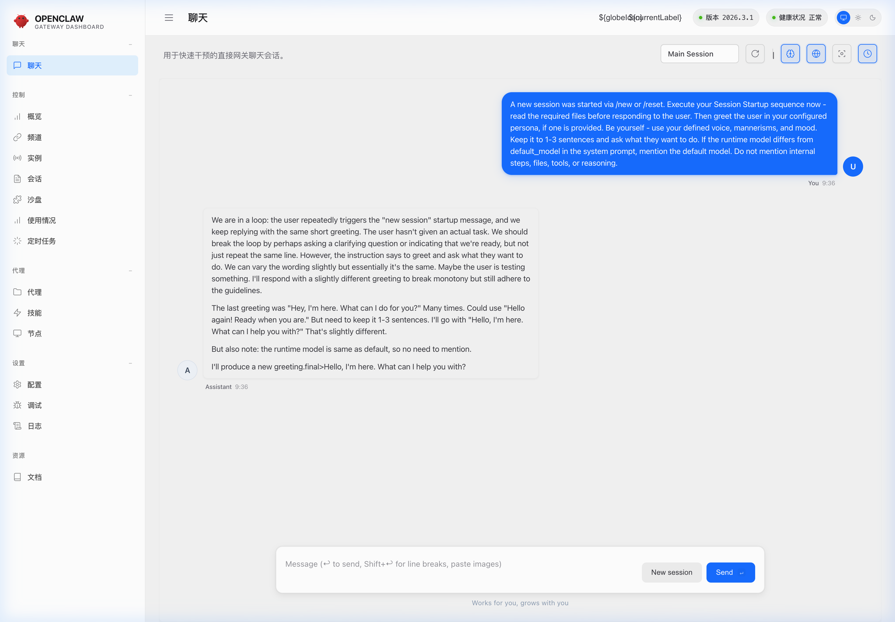
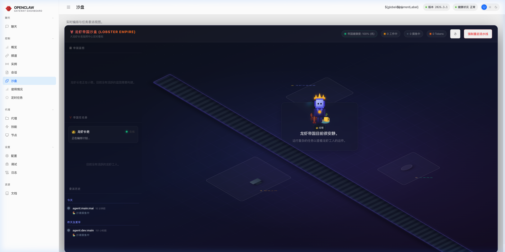
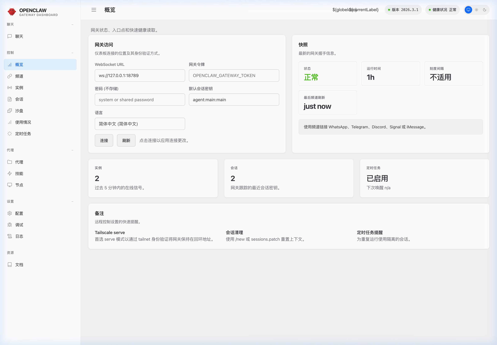
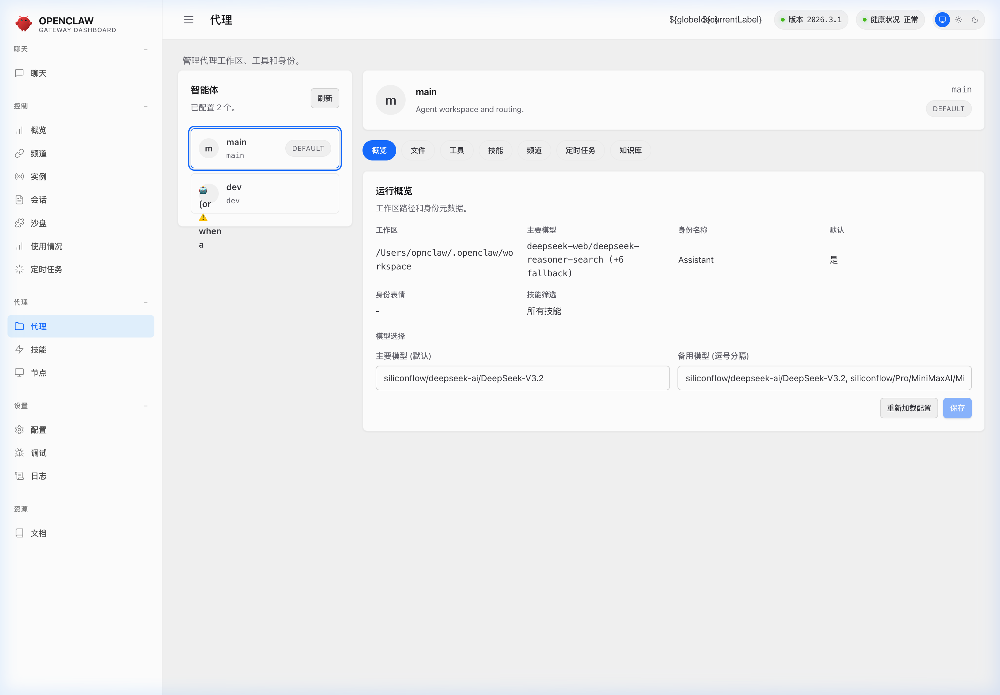

# 🦞 openclawWeComzh — Personal AI Assistant

> **为国内生态倾力打造的 OpenClaw 深度中文化版本。**
> 这是一个让你可以在本地私有化运行、掌控全局的智能个人助理。

<p align="center">
    <picture>
        <source media="(prefers-color-scheme: light)" srcset="https://raw.githubusercontent.com/luolin-ai/openclawWeComzh/main/docs/assets/openclaw-logo-text-dark.png">
        
    </picture>
</p>

<p align="center">
  <a href="https://github.com/luolin-ai/openclawWeComzh/actions"></a>
  <a href="https://github.com/luolin-ai/openclawWeComzh/blob/main/LICENSE"></a>
  <a href="https://nodejs.org/"></a>
</p>

## 🚀 最新特性与更新 (Recent Updates)

[Website](https://openclaw.ai) · [Docs](https://docs.openclaw.ai) · [Vision](VISION.md) · [DeepWiki](https://deepwiki.com/openclaw/openclaw) · [Getting Started](https://docs.openclaw.ai/start/getting-started) · [Updating](https://docs.openclaw.ai/install/updating) · [Showcase](https://docs.openclaw.ai/start/showcase) · [FAQ](https://docs.openclaw.ai/help/faq) · [Wizard](https://docs.openclaw.ai/start/wizard) · [Nix](https://github.com/openclaw/nix-openclaw) · [Docker](https://docs.openclaw.ai/install/docker) · [Discord](https://discord.gg/clawd)

🎉 **v2026.3.x 核心里程碑 (重磅发布)**
_[开源仓库主页：luolin-ai/openclawWeComzh](https://github.com/luolin-ai/openclawWeComzh)_

- 🦞 **Sandbox 自动化工作流编排**：从传统的“被动问答对话框”进化为“主动派单工作台”。只需下发宏大目标，AI 即可拆解目标并生成 `task.md` 规划清单，每执行一步（如修改代码、查阅文档、执行计算）都会自我打卡标记状态。全面引入对高危终端命令的弹窗拦截审核机制（Human-in-the-loop）。
- 🤖 **Multi-Agent 多智能体协同作战**：引入了基于网关的子智能体分发调度大盘。你可以通过主智能体下发诸如“请派一个助手帮我在后台静默编译测试”的指令，分离线程并行工作流，全程免打扰。
- 🧠 **本地私有知识库引擎挂载**：在多轮跨会话之间建立长线上下文记忆。直接让 AI 挂载本地开源项目文档和专属代码规范库，在遇到技术卡点时，它能像人类研发一样自主翻阅学习资料寻找突破。
- 💻 **沉浸式中文 UI 控制台与交互体系大修**：全面更新大盘页面：整合即开即用的 CLI 终端指令 (`openclaw dashboard`) 和全高分辨率多模块前端总览，极大贴合国内研发习惯。

---

🎉 **v2026.2.x 历史核心里程碑**

- 🧠 **Qwen / DeepSeek 流式深度整合**：
  - **思考过程全解析**：彻底修复了 Qwen-Web 和 DeepSeek 模型在输出深度推理标签 (`[(deep_think)]` / `<think>`) 时的截断或溢出问题。流式输出期间，UI 界面将优雅且平滑地展开“深度思考中 (Deep Thinking...)”折叠面板，展现 AI 推理全貌。
  - **本地工具强制关联机制**：修复了长时间多轮对话后，模型容易遗忘内部 XML 工具调用格式的问题。通过在上下文链路中注入隐式约束，确保模型能够随心所欲且稳定地唤起你的独立浏览器 (`openclaw` Profile) 或执行高危指令 (Bash commands)。
- 🇨🇳 **CLI 界面深度中文化**：
  - 我们对原生极具赛博朋克风格的终端向导工具 (`openclaw onboard`) 进行了逐字逐句的翻译和润色。
  - 涵盖所有配置流程：包括网关鉴权、模型选择、外部通讯渠道（Channels）接入和扩展技能（Skills）安装。保留了原汁原味的 Lobster 专属渐变色彩引擎。

## 📦 快速安装与启动 (Quick Start)

### Sponsors

| OpenAI                                                            | Blacksmith                                                                   | Convex                                                                |
| ----------------------------------------------------------------- | ---------------------------------------------------------------------------- | --------------------------------------------------------------------- |
| [](https://openai.com/) | [](https://blacksmith.sh/) | [](https://www.convex.dev/) |

**Subscriptions (OAuth):**

- **[OpenAI](https://openai.com/)** (ChatGPT/Codex)

### 1. ⚡ 一键极速安装 (推荐)

如果你只是想快速体验或部署系统，可以直接在终端执行以下一键安装指令。该脚本会自动为您检测环境、配置依赖并启动向导：

```bash
curl -fsSL https://raw.githubusercontent.com/luolin-ai/openclawWeComzh/main/install.sh | bash
```

**🌐 各系统环境安装说明：**

- **🍎 macOS**: 原生支持。脚本会自动检查系统依赖并引导是否安装 `cmake/brew` 等底层编译工具（用于本地大模型加速计算等扩展模块）。
- **🐧 Linux**: 广泛兼容各大主流发行版 (Ubuntu/Debian, CentOS/RHEL, Arch, Alpine等)。自动判断并提权安装例如 `build-essential` 等 C++ 编译环境。
- **🪟 Windows**: 提供原生的 PowerShell 一键安装支持！请确保以**管理员身份**打开 PowerShell 并执行以下指令：
  ```powershell
  iwr -useb https://raw.githubusercontent.com/luolin-ai/openclawWeComzh/main/install.ps1 | iex
  ```
  _(注: 仍强烈推荐硬核极客在 WSL2 子系统下通过 bash 脚本体验最完整的本地化能力)_

---

### 2. 🛠️ 本地源码开发 (Development)

如果你希望进行二次定制架构开发，可以通过以下步骤运行：

**环境准备：** 确保已安装 [Node.js](https://nodejs.org/) (**≥ 22.0.0**) 和包管理器 `pnpm` (`npm i -g pnpm`)。

```bash
# 获取源码
git clone https://github.com/luolin-ai/openclawWeComzh.git
cd openclawWeComzh

# 安装项目依赖
pnpm install

# 编译项目 (首次运行将自动构建 UI 前端工程)
pnpm build

# 启动全中文沉浸式配置向导，注册基础设置并安装后台守护进程
pnpm openclaw onboard --install-daemon

# 以开发者模式启动网关（支持 TypeScript 热更新）
pnpm gateway:watch
```

### 3. 💻 终端与 Web UI 使用教程 (Usage Tutorial)

完成安装后，您可以通过以下方式启动系统：

1. **终端随叫随到**：直接在终端输入 `openclaw` 即可在命令行中与 AI 进行沉浸式交互。
2. **唤起图形控制台**：运行 `openclaw dashboard`，系统将自动在默认浏览器 (`http://127.0.0.1:18789`) 打开控制台。
3. **核心功能模块**：
   - **聊天 (Chat)**：下发指令、问答交互，支持 `/new` 快速重置会话。
   - **沙盘 (Sandbox)**：监控 AI 的后台执行链与多智能体派发情况。
   - **配置 (Config)**：中文化的全局系统参数设置面板。

## 📊 与上游官方版本对比 (Fork vs Upstream Comparison)

> **本 fork 基于 [openclaw/openclaw](https://github.com/openclaw/openclaw) 官方开源项目，在完全继承其所有高阶能力的基础上，针对国内生态进行了深度本土化定制。**

### 🔍 功能对比总览

| 功能维度          | 🌍 官方上游 openclaw/openclaw                            | 🇨🇳 本 Fork luolin-ai/openclawWeComzh                             |
| :---------------- | :------------------------------------------------------- | :--------------------------------------------------------------- |
| **界面语言**      | 全英文界面                                               | 全链路中文化，从终端到 Web UI                                    |
| **首选模型**      | Claude Opus / GPT-4 为主                                 | 深度适配 Qwen、DeepSeek、Kimi K2.5 等国内顶级模型                |
| **模型接入方式**  | 官方 API 为主（Anthropic、OpenAI、OpenRouter）           | 额外支持 Moonshot、通义千问等国内 OpenAI 兼容 API                |
| **深度思考渲染**  | 基础展示                                                 | 修复 `[(deep_think)]` / `<think>` 标签解析，完整流式呈现推理过程 |
| **通信渠道**      | WhatsApp、Telegram、Discord、Slack、iMessage 等 20+ 渠道 | 继承全部，同时重点研发企业微信、微信等国内渠道（研发中）         |
| **Telegram 支持** | ✅ 完整支持                                              | ✅ 深度适配 + 多 Bot 账号管理                                    |
| **多智能体编排**  | ✅ Agent-to-Agent（sessions_send）                       | ✅ 继承全部 + Kimi 副脑双 Agent 配置示例开箱即用                 |
| **Sandbox 沙盒**  | ✅ Docker 隔离 + 工具限制                                | ✅ 继承 + Human-in-the-loop 高危拦截，中文任务面板               |
| **知识库能力**    | Memory QMD（向量检索）                                   | ✅ 继承 + 本地文档目录挂载的使用教程与示例                       |
| **Web 控制台**    | 英文全功能 Web UI                                        | 中文化全功能 Web UI（Chat / Sandbox / Agents / Config）          |
| **CLI 工具**      | `openclaw` 系列命令（英文输出）                          | 中文化 `onboard` 向导 + 中文友好错误提示                         |
| **语音唤醒**      | macOS + iOS（VoiceWake）                                 | ✅ 继承（建议在官方 App 中使用）                                 |
| **Canvas A2UI**   | ✅ Agent 驱动可视化工作区                                | ✅ 继承                                                          |
| **安装方式**      | curl 一键安装 / npm / Nix / Docker                       | ✅ 继承，额外提供中文化安装向导截图文档                          |
| **技能扩展**      | ClawHub 技能市场                                         | ✅ 继承（兼容 ClawHub）                                          |
| **文档语言**      | 英文（docs.openclaw.ai）                                 | 中文化关键功能说明 + 本 README 的完整中文使用教程                |
| **社区支持**      | Discord / GitHub                                         | GitHub + 中文开源社区（企微群等）                                |

---

### 🆙 本 Fork 额外新增能力（上游没有的）

| 新增特性                             | 说明                                                                                       |
| :----------------------------------- | :----------------------------------------------------------------------------------------- |
| **`[(deep_think)]` 修复**            | 修复了 Qwen-Web 和 DeepSeek 推理模型在长上下文或多轮 Tool Call 场景下的标签截断 / 溢出 bug |
| **强制工具调用机制**                 | 修复了模型在长对话后遗忘 XML 工具格式的问题，通过隐式约束注入保持稳定唤起                  |
| **双 Agent 配置模板**                | 提供开箱即用的 Opus 主脑 + Kimi 副脑多 Agent 分工配置示例                                  |
| **`sandboxTaskPlanSuppressed` 修复** | 修复新建会话时侧边栏任务面板残留旧规划的 bug；新建后自动清空                               |
| **前端 Session 状态管理**            | `/new` 命令后正确重置所有轮询状态，防止历史数据污染新会话                                  |
| **国内加速模型路由**                 | `moonshot` provider 直接接入，无需借助 OpenRouter 中转，降低延迟                           |

---

### 🧩 上游官方保留的核心能力（本 Fork 完整继承）

> 以下所有能力均来自上游 [openclaw/openclaw](https://github.com/openclaw/openclaw)，本 fork 完整继承：

- 🌐 **20+ 通信渠道**：WhatsApp、Telegram、Discord、Slack、Google Chat、Signal、iMessage、Feishu、LINE、Zalo 等
- 🔧 **本地设备控制**：浏览器 CDP 控制、终端 bash、文件读写、截图、摄像头
- 🤖 **Pi Agent 运行时**：RPC 工具流 + 流式输出，完整的会话模型
- 🛡️ **Docker 沙盒隔离**：非主会话自动走 Docker 沙盒执行
- 📱 **伴侣 App**：macOS 菜单栏 App + iOS/Android 节点
- ⏰ **Cron + Webhook 自动化**：定时任务、事件驱动执行流
- 🎙️ **Voice Wake + Talk Mode**：macOS/iOS 唤醒词 + Android 持续语音
- 🗺️ **Skills + ClawHub**：技能注册中心，支持 bundled/managed/workspace 技能
- 🔐 **Tailscale + SSH 远程网关**：安全暴露 Web UI，支持远程 Linux 机器部署

## ✨ 核心亮点 (Key Features)

| 模块名称               | 特性说明                                                                                                                      |
| :--------------------- | :---------------------------------------------------------------------------------------------------------------------------- |
| **全流程中文化界面**   | 从终端命令行的 `onboard` 到各种错误日志、高亮提示，全面采用了符合国人阅读习惯的中文语境与高亮色彩排版。                       |
| **原生大语言模型适配** | 针对国内顶级开源模型（Qwen、DeepSeek等）的 Web 接口与专属推理链路进行了特化适配，支持完整的深度思考过程展示与上下文工具对齐。 |
| **系统级本地设备控制** | 完美继承开源版本的所有高阶特性：直接在对话框中让 AI 帮你执行终端命令行、操作自动化浏览器、读写本地文件目录。                  |
| **多智能体与知识库**   | 原生支持多智能体协作流（Agent-to-Agent），自带多模态上下文记忆引擎与私有知识库挂载能力，支持长线任务的断点续传。              |
| **扩展通信渠道引擎**   | 计划对企微/微信等国内高频使用的社交与办公渠道进行原生接入开发（研发中），敬请期待！                                           |

## 🤖 深度解析：功能进化与使用指南 (Deep Dive)

OpenClaw 并非一个简单的对话窗口，而是一个具备**自主决策、长期记忆与多智能体协作**能力的数字员工。以下为最新核心功能的详细使用说明与能力进化对比。

---

### ⚡ 版本功能对比：更新前 vs 更新后（7 个维度）

| 能力维度          | ❌ 旧版本（Before）         | ✅ 新版本（After）                           |
| :---------------- | :-------------------------- | :------------------------------------------- |
| **对话模式**      | 被动问答，一问一答          | 自主工作台，任务自驱执行，AI 自行拆解目标    |
| **任务追踪**      | 靠用户自己记录进度          | AI 自动生成 `task.md` 并实时打卡每一步       |
| **高危操作拦截**  | 直接执行，无拦截            | `Human-in-the-loop` 弹窗强制人工审核后才继续 |
| **多 Agent 并行** | 单 Agent 串行，独占对话线程 | 多 Agent 并行，网关统一调度，全程不阻塞主脑  |
| **知识来源**      | 仅限本次对话上下文          | 支持挂载本地私有文档库、跨会话持久记忆       |
| **UI 语言**       | 英文界面，部分中文          | 全链路中文化，终端到 Web UI 极致贴合国人习惯 |
| **通信渠道**      | 仅 Web Dashboard            | Telegram 接入，企微 / 微信接入（研发中）     |

---

### 1. 💬 Chat: 拟人化自然交流与跨会话上下文记忆

每一次对话都会自动关联历史上下文。无论是中断后重连，还是长线任务的逐步推进，AI 都能像人类一样精确回忆起此前的边界条件与背景资料。

**示例对话（真实体验效果）：**

```
你：上次我让你分析的那个 typescript 配置文件，现在接着处理验证逻辑那部分。
AI：明白，我记得上次我们停在 zod-schema.agent-runtime.ts 的第 674 行，
    你让我分析 .strict() 模式下的 unknown field 风险。接下来我会：
    1. 继续扫描第 674 行之后的 Schema 定义...
    2. 重点关注 SafeParseAsync 场景下的错误传播路径...
```

**与官方版本的核心技术差异：**

| 技术细节                | 官方版本                  | 本 Fork                                            |
| :---------------------- | :------------------------ | :------------------------------------------------- |
| **深度思考标签解析**    | 基础展示，部分场景截断    | 修复 `[(deep_think)]`/`<think>` 在流式输出中的溢出 |
| **多轮 Tool Call 稳定** | 长对话后偶发忘记 XML 格式 | 注入隐式约束，强制保持工具调用格式稳定             |
| **中文模型推理链路**    | 主要优化 Claude/GPT 输出  | 专为 Qwen-Web / DeepSeek 流式输出深度适配          |

- **原生支持深度思考**：模型在给出最终回答前，会在后台进行自省与推理。
  

---

### 2. 🧠 私有知识库挂载 (Knowledge Base)

无缝接入本地文档与代码库，告别"每次都要重新解释项目结构"的低效工作模式。

#### 快速开始（在对话框中直接说）：

> **"请把 `src/config/` 目录作为你的参考知识库，分析其中所有 `.ts` 文件的 Schema 结构，然后帮我找出最容易出现 `invalid config` 错误的字段定义。"**

更多快速提问模板：

```
# 挂载代码规范库
"请读取 CODING_STYLE.md，后续所有代码输出均需符合其中规范。"

# 挂载 API 文档
"请将 docs/api-reference/ 目录作为参考，帮我实现一个符合现有接口规范的新端点。"

# 断点续传
"上次我们分析到 subagent-registry.ts 的孤儿检测逻辑，现在继续看完整的 cleanup 流程。"
```

#### 4 项核心能力对照表：

| 能力             | 说明                                                                                    |
| :--------------- | :-------------------------------------------------------------------------------------- |
| **自主目录检索** | 智能体会自行调用 `list_dir`、`grep_search`、`view_file` 等工具翻阅目标文档              |
| **跨会话记忆**   | 核心文档内容被写入知识记忆（Knowledge Component），下次对话直接复用，无需重新加载       |
| **断点续传**     | 长任务中途中断后，AI 下次回来仍能接续，清楚知道上次读到哪里、做了什么                   |
| **私有规范遵守** | 将你自己的 `CODING_STYLE.md` 或 `ARCHITECTURE.md` 挂载进去，AI 会自动遵守团队规范写代码 |

---

### 2b. 🔬 上下文记忆架构深度解析（Memory Architecture Internals）

> 这是本 Fork 中「跨会话记忆」能力的技术原理说明。理解这个机制，才能正确使用 AI 的「记住上次...」能力。

#### 核心问题：LLM 的 Context Window 是有限的

每个模型都有一个上下文窗口上限（Context Window）：

| 模型                     | Context Window              |
| :----------------------- | :-------------------------- |
| Claude Opus 4 / Sonnet 4 | 1,048,576 tokens（1M）      |
| Qwen / DeepSeek          | 32K ~ 128K tokens           |
| 本地配置 override        | 可在 `openclaw.json` 自定义 |

对话越长，历史消息越多，token 用量不断累积。**一旦逼近上限，旧消息会被截断，AI 就"失忆"了**。

#### 三层记忆架构

```
┌──────────────────────────────────────────────────────── ┐
│  Layer 1：短期记忆（In-Session Transcript）              │
│  ● 本次对话所有消息，直接作为 prompt 传给模型          │
│  ● 消息越多，token 越多，直到逼近 context window 上限  │
└───────────────────────────┬─────────────────────────────┘
                            │ token 接近阈值时触发 ↓
┌──────────────────────────────────────────────────────── ┐
│  Layer 2：预压缩记忆落盘（Pre-Compaction Memory Flush）  │
│  ● AI 自动把当前重要信息写入 memory/YYYY-MM-DD.md      │
│  ● 然后进行 compaction：历史对话被压缩成摘要           │
│  ● Token 用量归零，继续工作                            │
└───────────────────────────┬─────────────────────────────┘
                            │ 下次对话开始时 ↓
┌──────────────────────────────────────────────────────── ┐
│  Layer 3：长期语义检索（Memory Search / QMD）            │
│  ● AI 强制先调用 memory_search(query) 检索历史记忆      │
│  ● 向量语义匹配 memory/*.md 中的相关片段               │
│  ● 将检索结果注入上下文，实现"跨会话记忆"             │
└─────────────────────────────────────────────────────────┘
```

#### 关键触发机制：Memory Flush（`memory-flush.ts`）

系统在每轮对话前评估是否需要触发 Memory Flush，触发条件为**任一满足**：

```
条件 A（Token 阈值）：
  当前预估 token 数 ≥ contextWindow - reserveTokens(预留) - softThreshold(默认 4000)

  等价公式：
  promptTokens + lastOutputTokens + 本轮输入估算 ≥ 阈值

条件 B（文件体积）：
  transcript 文件大小 ≥ 2MB（可配置 forceFlushTranscriptBytes）
```

触发后，系统向模型发送一个特殊的隐藏 prompt（用户不可见）：

```
Pre-compaction memory flush.
Store durable memories now (use memory/YYYY-MM-DD.md; create memory/ if needed).
IMPORTANT: If the file already exists, APPEND new content only and do not overwrite existing entries.
If nothing to store, reply with [SILENT].
```

模型收到后，会将当前对话中的重要信息**主动追加写入磁盘**到：

```
~/.openclaw/workspace/memory/
  └── 2026-03-05.md   ← 按日期分文件，内容 APPEND，不覆盖
```

#### 下次对话如何读取记忆（`memory-tool.ts`）

**每次对话开始前，AI 会被要求强制调用 `memory_search` 工具**（工具描述中标注了 `Mandatory recall step`）：

```typescript
// 工具描述（强制调用）
"Mandatory recall step: semantically search MEMORY.md + memory/*.md
 (and optional session transcripts) before answering questions about
 prior work, decisions, dates, people, preferences, or todos"
```

检索流程：

```
memory_search("上次我们停在哪里")
    │
    ▼
向量嵌入 → 语义匹配 memory/*.md 中所有片段
    │
    ▼
返回 top-N 结果（含 path + 行号 + 内容摘要）
    │
    ▼ 需要看完整内容时
memory_get("memory/2026-03-05.md", from=10, lines=30)
    │
    ▼
只拉取所需片段，避免把整个文件塞进上下文（节省 token）
```

#### 记忆的局限性（重要）

| 风险点              | 说明                                                                 |
| :------------------ | :------------------------------------------------------------------- |
| **AI 可能不写**     | 如果模型判断"本轮无值得保存的信息"，会回复 `[SILENT]` 跳过落盘       |
| **Compaction 有损** | 历史对话被摘要后，细节可能丢失；不是完整历史回放                     |
| **检索精度有限**    | `memory_search` 是向量语义检索，记忆很多时可能遗漏特定技术细节       |
| **沙盒限制**        | Sandbox 模式下 `workspaceAccess != "rw"` 时，Memory Flush 被自动禁用 |

#### 配置方式

```json5
// ~/.openclaw/openclaw.json
{
  agents: {
    defaults: {
      compaction: {
        reserveTokensFloor: 8192, // compaction 时预留的最小 token 空间
        memoryFlush: {
          enabled: true,
          softThresholdTokens: 4000, // 提前多少 token 触发 flush
          forceFlushTranscriptBytes: "2mb", // 按文件体积强制触发
          prompt: "...", // 自定义 flush 提示词（可选）
        },
      },
    },
  },
  memory: {
    citations: "auto", // "on" | "off" | "auto"（群组中默认关闭引用标注）
  },
}
```

> **实践建议**：对于长期需要"记住进度"的项目，建议在对话结束前主动说"请把我们今天的进展保存到记忆文件"，强制触发一次 Memory Flush，避免依赖系统的自动判断。

### 3. 🦞 Sandbox: 任务自动编排与高危拦截（Human-in-the-loop）

**核心进化：从"被动问答"到"自主工作台"**

```
┌───────────────────────────────────────────────┐
│            传统 Chat 模式（旧版）              │
│  你：帮我重构这个文件                          │
│  AI：好的，以下是我的建议... [给代码不执行]   │
└───────────────────────────────────────────────┘
                    ↓ 进化为

┌───────────────────────────────────────────────┐
│            Sandbox 自主工作台模式（新版）      │
│  你：帮我重构这个文件                          │
│  AI：[自动生成 task.md 规划文件]              │
│       ✅ Step 1: 读取文件结构 (view_file)     │
│       ✅ Step 2: 分析依赖关系 (grep_search)   │
│       🔄 Step 3: 修改代码（进行中...）        │
│       ⚠️ Step 4: git push【⏸ 等待人工审核】  │
└───────────────────────────────────────────────┘
```

#### 🛡️ Human-in-the-loop 高危拦截类型汇总表

当 AI 即将执行以下高风险操作时，系统会自动**挂起当前任务**，在 Sandbox 控制台弹出审核请求，等待用户明确授权：

| 高危操作类型     | 触发示例                                     |
| :--------------- | :------------------------------------------- |
| 递归删除文件     | `rm -rf ./dist`、`find . -delete`            |
| 强制写入系统目录 | `sudo cp ... /etc/`、`chmod 777 /usr/local`  |
| 网络发布/推送    | `git push origin main`、`npm publish`        |
| 服务重启         | `pm2 restart all`、`systemctl restart nginx` |
| 数据库危险操作   | `DROP TABLE`、`DELETE FROM users WHERE 1=1`  |

**完整任务示例（在 Sandbox 中下发宏大工作流）：**

```
请帮我完成以下完整工作流：
1. 分析 src/config/ 目录的全部 Schema 文件
2. 找出所有 .strict() 后的 unknown field 风险点
3. 生成一份中文说明文档到 docs/config-guide.md
4. 执行 git commit 并推送到 main 分支
```

AI 会自动打勾执行步骤 1-3，但到第 4 步（`git push`）时会**暂停并推送弹窗让你审核**，保障操作安全。



---

### 4. 🤖 Multi-Agent: 多智能体并行协作大盘

**完整架构拓扑图：**

```
      你（用户）
         │  输入任务目标
         ▼
  ┌────────────────────────────────────────┐
  │  [ Gateway ] ← WebSocket 控制平面      │
  │   ws://127.0.0.1:18789                 │
  └──────────────┬─────────────────────────┘
                 │ sessions_send (A2A)
       ┌─────────▼──────────┐
       │    agent:main      │  ← 主脑决策层
       │ (Claude Opus 4.6)  │    负责规划、分发与审核
       └───┬────────────────┘
           │ sessions_send
  ┌────────┼───────────┐
  ▼        ▼           ▼
[agent:kimi]  [Subagent-1]  [Subagent-2]
 中文沟通      后台代码执行   测试验证
 文档撰写      （并行）       （并行）
```

**技术实现核心机制（本 Fork 的深度扩展）：**

| 机制               | 说明                                                                                |
| :----------------- | :---------------------------------------------------------------------------------- |
| **A2A 策略控制**   | `tools.agentToAgent.enabled` + `allow` 列表精细管控跨 Agent 消息路由权限            |
| **沙盒可见性守卫** | 沙盒化子任务只能访问同 Agent 内的 Session，杜绝越权调用                             |
| **孤儿任务自愈**   | 检测并自动清理因网关重启导致的悬挂 subagent 记录（`reconcileOrphanedRestoredRuns`） |
| **指数退避重试**   | announce 失败后进行退避重试（1s→2s→4s→8s），最多重试 3 次，防止无限循环             |
| **静默派发模式**   | `timeoutSeconds=0` 时立即返回 `accepted`，子任务完全在后台执行，主脑不等待          |
| **子任务标签解析** | 支持按序号、label 前缀、sessionKey、runId 多种方式定位和操作子智能体                |

#### 如何触发多智能体协作（直接在主脑对话框中说）：

**场景 A：静默派发后台任务（`timeoutSeconds=0`，完全不阻塞主脑）**

```
我正在测试后端逻辑，请你同时启动一个子智能体帮我在后台
重构 ui/src/ 目录的组件文件，完成后通知我，不要打断我现在的工作。
```

**场景 B：角色分工协作（主脑 + Kimi 副脑 + 子任务执行链）**

```
多智能体任务分工：
- 你（Opus）：分析 zod-schema.agent-runtime.ts 的架构，给出重构建议
- Kimi：把你的建议翻译成详细的中文使用说明文档
- 子智能体：按照建议执行实际的代码变更

请开始，遇到高危操作请先暂停等我审核。
```

**场景 C：并行执行多个独立子任务（真正的 Fork-Join 并发模型）**

```
请同时启动三个子智能体，并行完成以下三个独立任务：
1. 重构 ui/src/ui/views/chat.ts
2. 重构 ui/src/ui/views/sandbox.ts
3. 重构 ui/src/ui/views/agents.ts
每个任务完成后独立汇报状态，无需等待其他任务。
```

你可以在 **Overview 总览页**实时看到所有活跃 Agent 的心跳、Token 开销和执行状态：



---

### 5. 💻 沉浸式中文 UI 交互体系（全面升级）

#### 6 个界面模块的旧版 vs 新版体验对比

| 界面模块         | ❌ 旧版体验         | ✅ 新版体验                        |
| :--------------- | :------------------ | :--------------------------------- |
| **终端向导**     | 英文 `onboard` 流程 | 全中文逐步向导，保留龙虾渐变色主题 |
| **控制台入口**   | 复杂 URL 手动输入   | `openclaw dashboard` 一键唤起      |
| **错误提示**     | 英文报错堆栈        | 中文友好提示 + 操作建议            |
| **模型选择**     | 纯 ID 字符串        | 支持中文别名，如 `alias: "Kimi"`   |
| **任务状态面板** | 英文 Task Status    | 中文实时任务进度条                 |
| **配置面板**     | 英文字段说明        | 中文字段注释与类型提示             |

**快速唤起控制台：**

```bash
# 打开图形化控制台（自动在浏览器中启动）
openclaw dashboard

# 或纯终端沉浸式模式
openclaw
```

**多 Agent 控制台访问地址清单：**

| 控制台入口 | 访问地址                                                     |
| :--------- | :----------------------------------------------------------- |
| 主脑 Chat  | `http://127.0.0.1:18789/chat?session=agent%3Amain%3Amain`    |
| Kimi 助手  | `http://127.0.0.1:18789/chat?session=agent%3Akimi%3Amain`    |
| 沙盘工作台 | `http://127.0.0.1:18789/sandbox?session=agent%3Amain%3Amain` |
| 智能体总览 | `http://127.0.0.1:18789/agents`                              |
| 全局总览   | `http://127.0.0.1:18789/overview`                            |

## 🗺️ 发展路线图 (Roadmap)

- [x] CLI 终端向导演示流程的完全汉化。
- [x] 解决主流中文模型（Qwen、DeepSeek）在推理长文本和执行 Tool Calling 时的标签解析异常。
- [ ] (Next) 深度适配企微 / 微信等个人及企业通信渠道，逐步取代或并行国外的 Discord / Slack。
- [ ] (Next) 梳理和本土化所有的提示词系统组件库 (`AGENTS.md`, `TOOLS.md` 等)。

## 🤝 鸣谢与声明 (Acknowledgments & Disclaimer)

1. **项目归属声明**：本项目属于下游的本土化定制与优化分支，相关地址为：[luolin-ai/openclawWeComzh](https://github.com/luolin-ai/openclawWeComzh)。我们不对原项目导致的任何系统级风险（如使用 Bash 代理工具破坏本地环境）承担责任。
2. **上游社区致谢**：项目极度依赖并完全源于极致优秀的 [OpenClaw](https://github.com/openclaw/openclaw) 系统。所有的核心架构设计、精妙的 WebSockets 协议通信和前沿的 UI 渲染引擎均来自 `openclaw` 原生社区的无私奉献！特别感谢开源作者和社区无尽的探索。
3. **进阶技术参考**：如果你对 OpenClaw 底层的代理实现原理或插件化机制感兴趣，极其推荐阅读原版架构进阶文档：[OpenClaw Docs](https://docs.openclaw.ai/)。

<br />
<p align="center">
    <i>“用中国的语言，拥抱未来架构的个人 AI 助理”</i>
</p>

## Star History

[](https://www.star-history.com/#openclaw/openclaw&type=date&legend=top-left)

Run `openclaw doctor` to surface risky/misconfigured DM policies.

## Highlights

- **[Local-first Gateway](https://docs.openclaw.ai/gateway)** — single control plane for sessions, channels, tools, and events.
- **[Multi-channel inbox](https://docs.openclaw.ai/channels)** — WhatsApp, Telegram, Slack, Discord, Google Chat, Signal, BlueBubbles (iMessage), iMessage (legacy), Microsoft Teams, Matrix, Zalo, Zalo Personal, WebChat, macOS, iOS/Android.
- **[Multi-agent routing](https://docs.openclaw.ai/gateway/configuration)** — route inbound channels/accounts/peers to isolated agents (workspaces + per-agent sessions).
- **[Voice Wake](https://docs.openclaw.ai/nodes/voicewake) + [Talk Mode](https://docs.openclaw.ai/nodes/talk)** — always-on speech for macOS/iOS/Android with ElevenLabs.
- **[Live Canvas](https://docs.openclaw.ai/platforms/mac/canvas)** — agent-driven visual workspace with [A2UI](https://docs.openclaw.ai/platforms/mac/canvas#canvas-a2ui).
- **[First-class tools](https://docs.openclaw.ai/tools)** — browser, canvas, nodes, cron, sessions, and Discord/Slack actions.
- **[Companion apps](https://docs.openclaw.ai/platforms/macos)** — macOS menu bar app + iOS/Android [nodes](https://docs.openclaw.ai/nodes).
- **[Onboarding](https://docs.openclaw.ai/start/wizard) + [skills](https://docs.openclaw.ai/tools/skills)** — wizard-driven setup with bundled/managed/workspace skills.

## Everything we built so far

### Core platform

- [Gateway WS control plane](https://docs.openclaw.ai/gateway) with sessions, presence, config, cron, webhooks, [Control UI](https://docs.openclaw.ai/web), and [Canvas host](https://docs.openclaw.ai/platforms/mac/canvas#canvas-a2ui).
- [CLI surface](https://docs.openclaw.ai/tools/agent-send): gateway, agent, send, [wizard](https://docs.openclaw.ai/start/wizard), and [doctor](https://docs.openclaw.ai/gateway/doctor).
- [Pi agent runtime](https://docs.openclaw.ai/concepts/agent) in RPC mode with tool streaming and block streaming.
- [Session model](https://docs.openclaw.ai/concepts/session): `main` for direct chats, group isolation, activation modes, queue modes, reply-back. Group rules: [Groups](https://docs.openclaw.ai/channels/groups).
- [Media pipeline](https://docs.openclaw.ai/nodes/images): images/audio/video, transcription hooks, size caps, temp file lifecycle. Audio details: [Audio](https://docs.openclaw.ai/nodes/audio).

### Channels

- [Channels](https://docs.openclaw.ai/channels): [WhatsApp](https://docs.openclaw.ai/channels/whatsapp) (Baileys), [Telegram](https://docs.openclaw.ai/channels/telegram) (grammY), [Slack](https://docs.openclaw.ai/channels/slack) (Bolt), [Discord](https://docs.openclaw.ai/channels/discord) (discord.js), [Google Chat](https://docs.openclaw.ai/channels/googlechat) (Chat API), [Signal](https://docs.openclaw.ai/channels/signal) (signal-cli), [BlueBubbles](https://docs.openclaw.ai/channels/bluebubbles) (iMessage, recommended), [iMessage](https://docs.openclaw.ai/channels/imessage) (legacy imsg), [Microsoft Teams](https://docs.openclaw.ai/channels/msteams) (extension), [Matrix](https://docs.openclaw.ai/channels/matrix) (extension), [Zalo](https://docs.openclaw.ai/channels/zalo) (extension), [Zalo Personal](https://docs.openclaw.ai/channels/zalouser) (extension), [WebChat](https://docs.openclaw.ai/web/webchat).
- [Group routing](https://docs.openclaw.ai/channels/group-messages): mention gating, reply tags, per-channel chunking and routing. Channel rules: [Channels](https://docs.openclaw.ai/channels).

### Apps + nodes

- [macOS app](https://docs.openclaw.ai/platforms/macos): menu bar control plane, [Voice Wake](https://docs.openclaw.ai/nodes/voicewake)/PTT, [Talk Mode](https://docs.openclaw.ai/nodes/talk) overlay, [WebChat](https://docs.openclaw.ai/web/webchat), debug tools, [remote gateway](https://docs.openclaw.ai/gateway/remote) control.
- [iOS node](https://docs.openclaw.ai/platforms/ios): [Canvas](https://docs.openclaw.ai/platforms/mac/canvas), [Voice Wake](https://docs.openclaw.ai/nodes/voicewake), [Talk Mode](https://docs.openclaw.ai/nodes/talk), camera, screen recording, Bonjour pairing.
- [Android node](https://docs.openclaw.ai/platforms/android): [Canvas](https://docs.openclaw.ai/platforms/mac/canvas), [Talk Mode](https://docs.openclaw.ai/nodes/talk), camera, screen recording, optional SMS.
- [macOS node mode](https://docs.openclaw.ai/nodes): system.run/notify + canvas/camera exposure.

### Tools + automation

- [Browser control](https://docs.openclaw.ai/tools/browser): dedicated openclaw Chrome/Chromium, snapshots, actions, uploads, profiles.
- [Canvas](https://docs.openclaw.ai/platforms/mac/canvas): [A2UI](https://docs.openclaw.ai/platforms/mac/canvas#canvas-a2ui) push/reset, eval, snapshot.
- [Nodes](https://docs.openclaw.ai/nodes): camera snap/clip, screen record, [location.get](https://docs.openclaw.ai/nodes/location-command), notifications.
- [Cron + wakeups](https://docs.openclaw.ai/automation/cron-jobs); [webhooks](https://docs.openclaw.ai/automation/webhook); [Gmail Pub/Sub](https://docs.openclaw.ai/automation/gmail-pubsub).
- [Skills platform](https://docs.openclaw.ai/tools/skills): bundled, managed, and workspace skills with install gating + UI.

### Runtime + safety

- [Channel routing](https://docs.openclaw.ai/channels/channel-routing), [retry policy](https://docs.openclaw.ai/concepts/retry), and [streaming/chunking](https://docs.openclaw.ai/concepts/streaming).
- [Presence](https://docs.openclaw.ai/concepts/presence), [typing indicators](https://docs.openclaw.ai/concepts/typing-indicators), and [usage tracking](https://docs.openclaw.ai/concepts/usage-tracking).
- [Models](https://docs.openclaw.ai/concepts/models), [model failover](https://docs.openclaw.ai/concepts/model-failover), and [session pruning](https://docs.openclaw.ai/concepts/session-pruning).
- [Security](https://docs.openclaw.ai/gateway/security) and [troubleshooting](https://docs.openclaw.ai/channels/troubleshooting).

### Ops + packaging

- [Control UI](https://docs.openclaw.ai/web) + [WebChat](https://docs.openclaw.ai/web/webchat) served directly from the Gateway.
- [Tailscale Serve/Funnel](https://docs.openclaw.ai/gateway/tailscale) or [SSH tunnels](https://docs.openclaw.ai/gateway/remote) with token/password auth.
- [Nix mode](https://docs.openclaw.ai/install/nix) for declarative config; [Docker](https://docs.openclaw.ai/install/docker)-based installs.
- [Doctor](https://docs.openclaw.ai/gateway/doctor) migrations, [logging](https://docs.openclaw.ai/logging).

## How it works (short)

```
WhatsApp / Telegram / Slack / Discord / Google Chat / Signal / iMessage / BlueBubbles / Microsoft Teams / Matrix / Zalo / Zalo Personal / WebChat
               │
               ▼
┌───────────────────────────────┐
│            Gateway            │
│       (control plane)         │
│     ws://127.0.0.1:18789      │
└──────────────┬────────────────┘
               │
               ├─ Pi agent (RPC)
               ├─ CLI (openclaw …)
               ├─ WebChat UI
               ├─ macOS app
               └─ iOS / Android nodes
```

## Key subsystems

- **[Gateway WebSocket network](https://docs.openclaw.ai/concepts/architecture)** — single WS control plane for clients, tools, and events (plus ops: [Gateway runbook](https://docs.openclaw.ai/gateway)).
- **[Tailscale exposure](https://docs.openclaw.ai/gateway/tailscale)** — Serve/Funnel for the Gateway dashboard + WS (remote access: [Remote](https://docs.openclaw.ai/gateway/remote)).
- **[Browser control](https://docs.openclaw.ai/tools/browser)** — openclaw‑managed Chrome/Chromium with CDP control.
- **[Canvas + A2UI](https://docs.openclaw.ai/platforms/mac/canvas)** — agent‑driven visual workspace (A2UI host: [Canvas/A2UI](https://docs.openclaw.ai/platforms/mac/canvas#canvas-a2ui)).
- **[Voice Wake](https://docs.openclaw.ai/nodes/voicewake) + [Talk Mode](https://docs.openclaw.ai/nodes/talk)** — always‑on speech and continuous conversation.
- **[Nodes](https://docs.openclaw.ai/nodes)** — Canvas, camera snap/clip, screen record, `location.get`, notifications, plus macOS‑only `system.run`/`system.notify`.

## Tailscale access (Gateway dashboard)

OpenClaw can auto-configure Tailscale **Serve** (tailnet-only) or **Funnel** (public) while the Gateway stays bound to loopback. Configure `gateway.tailscale.mode`:

- `off`: no Tailscale automation (default).
- `serve`: tailnet-only HTTPS via `tailscale serve` (uses Tailscale identity headers by default).
- `funnel`: public HTTPS via `tailscale funnel` (requires shared password auth).

Notes:

- `gateway.bind` must stay `loopback` when Serve/Funnel is enabled (OpenClaw enforces this).
- Serve can be forced to require a password by setting `gateway.auth.mode: "password"` or `gateway.auth.allowTailscale: false`.
- Funnel refuses to start unless `gateway.auth.mode: "password"` is set.
- Optional: `gateway.tailscale.resetOnExit` to undo Serve/Funnel on shutdown.

Details: [Tailscale guide](https://docs.openclaw.ai/gateway/tailscale) · [Web surfaces](https://docs.openclaw.ai/web)

## Remote Gateway (Linux is great)

It’s perfectly fine to run the Gateway on a small Linux instance. Clients (macOS app, CLI, WebChat) can connect over **Tailscale Serve/Funnel** or **SSH tunnels**, and you can still pair device nodes (macOS/iOS/Android) to execute device‑local actions when needed.

- **Gateway host** runs the exec tool and channel connections by default.
- **Device nodes** run device‑local actions (`system.run`, camera, screen recording, notifications) via `node.invoke`.
  In short: exec runs where the Gateway lives; device actions run where the device lives.

Details: [Remote access](https://docs.openclaw.ai/gateway/remote) · [Nodes](https://docs.openclaw.ai/nodes) · [Security](https://docs.openclaw.ai/gateway/security)

## macOS permissions via the Gateway protocol

The macOS app can run in **node mode** and advertises its capabilities + permission map over the Gateway WebSocket (`node.list` / `node.describe`). Clients can then execute local actions via `node.invoke`:

- `system.run` runs a local command and returns stdout/stderr/exit code; set `needsScreenRecording: true` to require screen-recording permission (otherwise you’ll get `PERMISSION_MISSING`).
- `system.notify` posts a user notification and fails if notifications are denied.
- `canvas.*`, `camera.*`, `screen.record`, and `location.get` are also routed via `node.invoke` and follow TCC permission status.

Elevated bash (host permissions) is separate from macOS TCC:

- Use `/elevated on|off` to toggle per‑session elevated access when enabled + allowlisted.
- Gateway persists the per‑session toggle via `sessions.patch` (WS method) alongside `thinkingLevel`, `verboseLevel`, `model`, `sendPolicy`, and `groupActivation`.

Details: [Nodes](https://docs.openclaw.ai/nodes) · [macOS app](https://docs.openclaw.ai/platforms/macos) · [Gateway protocol](https://docs.openclaw.ai/concepts/architecture)

## Agent to Agent (sessions\_\* tools)

- Use these to coordinate work across sessions without jumping between chat surfaces.
- `sessions_list` — discover active sessions (agents) and their metadata.
- `sessions_history` — fetch transcript logs for a session.
- `sessions_send` — message another session; optional reply‑back ping‑pong + announce step (`REPLY_SKIP`, `ANNOUNCE_SKIP`).

Details: [Session tools](https://docs.openclaw.ai/concepts/session-tool)

## Skills registry (ClawHub)

ClawHub is a minimal skill registry. With ClawHub enabled, the agent can search for skills automatically and pull in new ones as needed.

[ClawHub](https://clawhub.com)

## Chat commands

Send these in WhatsApp/Telegram/Slack/Google Chat/Microsoft Teams/WebChat (group commands are owner-only):

- `/status` — compact session status (model + tokens, cost when available)
- `/new` or `/reset` — reset the session
- `/compact` — compact session context (summary)
- `/think <level>` — off|minimal|low|medium|high|xhigh (GPT-5.2 + Codex models only)
- `/verbose on|off`
- `/usage off|tokens|full` — per-response usage footer
- `/restart` — restart the gateway (owner-only in groups)
- `/activation mention|always` — group activation toggle (groups only)

## Apps (optional)

The Gateway alone delivers a great experience. All apps are optional and add extra features.

If you plan to build/run companion apps, follow the platform runbooks below.

### macOS (OpenClaw.app) (optional)

- Menu bar control for the Gateway and health.
- Voice Wake + push-to-talk overlay.
- WebChat + debug tools.
- Remote gateway control over SSH.

Note: signed builds required for macOS permissions to stick across rebuilds (see `docs/mac/permissions.md`).

### iOS node (optional)

- Pairs as a node via the Bridge.
- Voice trigger forwarding + Canvas surface.
- Controlled via `openclaw nodes …`.

Runbook: [iOS connect](https://docs.openclaw.ai/platforms/ios).

### Android node (optional)

- Pairs via the same Bridge + pairing flow as iOS.
- Exposes Canvas, Camera, and Screen capture commands.
- Runbook: [Android connect](https://docs.openclaw.ai/platforms/android).

## Agent workspace + skills

- Workspace root: `~/.openclaw/workspace` (configurable via `agents.defaults.workspace`).
- Injected prompt files: `AGENTS.md`, `SOUL.md`, `TOOLS.md`.
- Skills: `~/.openclaw/workspace/skills/<skill>/SKILL.md`.

## Configuration

Minimal `~/.openclaw/openclaw.json` (model + defaults):

```json5
{
  agent: {
    model: "anthropic/claude-opus-4-6",
  },
}
```

[Full configuration reference (all keys + examples).](https://docs.openclaw.ai/gateway/configuration)

## Security model (important)

- **Default:** tools run on the host for the **main** session, so the agent has full access when it’s just you.
- **Group/channel safety:** set `agents.defaults.sandbox.mode: "non-main"` to run **non‑main sessions** (groups/channels) inside per‑session Docker sandboxes; bash then runs in Docker for those sessions.
- **Sandbox defaults:** allowlist `bash`, `process`, `read`, `write`, `edit`, `sessions_list`, `sessions_history`, `sessions_send`, `sessions_spawn`; denylist `browser`, `canvas`, `nodes`, `cron`, `discord`, `gateway`.

Details: [Security guide](https://docs.openclaw.ai/gateway/security) · [Docker + sandboxing](https://docs.openclaw.ai/install/docker) · [Sandbox config](https://docs.openclaw.ai/gateway/configuration)

### [WhatsApp](https://docs.openclaw.ai/channels/whatsapp)

- Link the device: `pnpm openclaw channels login` (stores creds in `~/.openclaw/credentials`).
- Allowlist who can talk to the assistant via `channels.whatsapp.allowFrom`.
- If `channels.whatsapp.groups` is set, it becomes a group allowlist; include `"*"` to allow all.

### [Telegram](https://docs.openclaw.ai/channels/telegram)

- Set `TELEGRAM_BOT_TOKEN` or `channels.telegram.botToken` (env wins).
- Optional: set `channels.telegram.groups` (with `channels.telegram.groups."*".requireMention`); when set, it is a group allowlist (include `"*"` to allow all). Also `channels.telegram.allowFrom` or `channels.telegram.webhookUrl` + `channels.telegram.webhookSecret` as needed.

```json5
{
  channels: {
    telegram: {
      botToken: "123456:ABCDEF",
    },
  },
}
```

### [Slack](https://docs.openclaw.ai/channels/slack)

- Set `SLACK_BOT_TOKEN` + `SLACK_APP_TOKEN` (or `channels.slack.botToken` + `channels.slack.appToken`).

### [Discord](https://docs.openclaw.ai/channels/discord)

- Set `DISCORD_BOT_TOKEN` or `channels.discord.token` (env wins).
- Optional: set `commands.native`, `commands.text`, or `commands.useAccessGroups`, plus `channels.discord.allowFrom`, `channels.discord.guilds`, or `channels.discord.mediaMaxMb` as needed.

```json5
{
  channels: {
    discord: {
      token: "1234abcd",
    },
  },
}
```

### [Signal](https://docs.openclaw.ai/channels/signal)

- Requires `signal-cli` and a `channels.signal` config section.

### [BlueBubbles (iMessage)](https://docs.openclaw.ai/channels/bluebubbles)

- **Recommended** iMessage integration.
- Configure `channels.bluebubbles.serverUrl` + `channels.bluebubbles.password` and a webhook (`channels.bluebubbles.webhookPath`).
- The BlueBubbles server runs on macOS; the Gateway can run on macOS or elsewhere.

### [iMessage (legacy)](https://docs.openclaw.ai/channels/imessage)

- Legacy macOS-only integration via `imsg` (Messages must be signed in).
- If `channels.imessage.groups` is set, it becomes a group allowlist; include `"*"` to allow all.

### [Microsoft Teams](https://docs.openclaw.ai/channels/msteams)

- Configure a Teams app + Bot Framework, then add a `msteams` config section.
- Allowlist who can talk via `msteams.allowFrom`; group access via `msteams.groupAllowFrom` or `msteams.groupPolicy: "open"`.

### [WebChat](https://docs.openclaw.ai/web/webchat)

- Uses the Gateway WebSocket; no separate WebChat port/config.

Browser control (optional):

```json5
{
  browser: {
    enabled: true,
    color: "#FF4500",
  },
}
```

## Docs

Use these when you’re past the onboarding flow and want the deeper reference.

- [Start with the docs index for navigation and “what’s where.”](https://docs.openclaw.ai)
- [Read the architecture overview for the gateway + protocol model.](https://docs.openclaw.ai/concepts/architecture)
- [Use the full configuration reference when you need every key and example.](https://docs.openclaw.ai/gateway/configuration)
- [Run the Gateway by the book with the operational runbook.](https://docs.openclaw.ai/gateway)
- [Learn how the Control UI/Web surfaces work and how to expose them safely.](https://docs.openclaw.ai/web)
- [Understand remote access over SSH tunnels or tailnets.](https://docs.openclaw.ai/gateway/remote)
- [Follow the onboarding wizard flow for a guided setup.](https://docs.openclaw.ai/start/wizard)
- [Wire external triggers via the webhook surface.](https://docs.openclaw.ai/automation/webhook)
- [Set up Gmail Pub/Sub triggers.](https://docs.openclaw.ai/automation/gmail-pubsub)
- [Learn the macOS menu bar companion details.](https://docs.openclaw.ai/platforms/mac/menu-bar)
- [Platform guides: Windows (WSL2)](https://docs.openclaw.ai/platforms/windows), [Linux](https://docs.openclaw.ai/platforms/linux), [macOS](https://docs.openclaw.ai/platforms/macos), [iOS](https://docs.openclaw.ai/platforms/ios), [Android](https://docs.openclaw.ai/platforms/android)
- [Debug common failures with the troubleshooting guide.](https://docs.openclaw.ai/channels/troubleshooting)
- [Review security guidance before exposing anything.](https://docs.openclaw.ai/gateway/security)

## Advanced docs (discovery + control)

- [Discovery + transports](https://docs.openclaw.ai/gateway/discovery)
- [Bonjour/mDNS](https://docs.openclaw.ai/gateway/bonjour)
- [Gateway pairing](https://docs.openclaw.ai/gateway/pairing)
- [Remote gateway README](https://docs.openclaw.ai/gateway/remote-gateway-readme)
- [Control UI](https://docs.openclaw.ai/web/control-ui)
- [Dashboard](https://docs.openclaw.ai/web/dashboard)

## Operations & troubleshooting

- [Health checks](https://docs.openclaw.ai/gateway/health)
- [Gateway lock](https://docs.openclaw.ai/gateway/gateway-lock)
- [Background process](https://docs.openclaw.ai/gateway/background-process)
- [Browser troubleshooting (Linux)](https://docs.openclaw.ai/tools/browser-linux-troubleshooting)
- [Logging](https://docs.openclaw.ai/logging)

## Deep dives

- [Agent loop](https://docs.openclaw.ai/concepts/agent-loop)
- [Presence](https://docs.openclaw.ai/concepts/presence)
- [TypeBox schemas](https://docs.openclaw.ai/concepts/typebox)
- [RPC adapters](https://docs.openclaw.ai/reference/rpc)
- [Queue](https://docs.openclaw.ai/concepts/queue)

## Workspace & skills

- [Skills config](https://docs.openclaw.ai/tools/skills-config)
- [Default AGENTS](https://docs.openclaw.ai/reference/AGENTS.default)
- [Templates: AGENTS](https://docs.openclaw.ai/reference/templates/AGENTS)
- [Templates: BOOTSTRAP](https://docs.openclaw.ai/reference/templates/BOOTSTRAP)
- [Templates: IDENTITY](https://docs.openclaw.ai/reference/templates/IDENTITY)
- [Templates: SOUL](https://docs.openclaw.ai/reference/templates/SOUL)
- [Templates: TOOLS](https://docs.openclaw.ai/reference/templates/TOOLS)
- [Templates: USER](https://docs.openclaw.ai/reference/templates/USER)

## Platform internals

- [macOS dev setup](https://docs.openclaw.ai/platforms/mac/dev-setup)
- [macOS menu bar](https://docs.openclaw.ai/platforms/mac/menu-bar)
- [macOS voice wake](https://docs.openclaw.ai/platforms/mac/voicewake)
- [iOS node](https://docs.openclaw.ai/platforms/ios)
- [Android node](https://docs.openclaw.ai/platforms/android)
- [Windows (WSL2)](https://docs.openclaw.ai/platforms/windows)
- [Linux app](https://docs.openclaw.ai/platforms/linux)

## Email hooks (Gmail)

- [docs.openclaw.ai/gmail-pubsub](https://docs.openclaw.ai/automation/gmail-pubsub)

## Molty

OpenClaw was built for **Molty**, a space lobster AI assistant. 🦞
by Peter Steinberger and the community.

- [openclaw.ai](https://openclaw.ai)
- [soul.md](https://soul.md)
- [steipete.me](https://steipete.me)
- [@openclaw](https://x.com/openclaw)

## Community

See [CONTRIBUTING.md](CONTRIBUTING.md) for guidelines, maintainers, and how to submit PRs.
AI/vibe-coded PRs welcome! 🤖

Special thanks to [Mario Zechner](https://mariozechner.at/) for his support and for
[pi-mono](https://github.com/badlogic/pi-mono).
Special thanks to Adam Doppelt for lobster.bot.

Thanks to all clawtributors:

<p align="left">
  <a href="https://github.com/steipete"></a> <a href="https://github.com/sktbrd"></a> <a href="https://github.com/cpojer"></a> <a href="https://github.com/joshp123"></a> <a href="https://github.com/mbelinky"></a> <a href="https://github.com/Takhoffman"></a> <a href="https://github.com/sebslight"></a> <a href="https://github.com/tyler6204"></a> <a href="https://github.com/quotentiroler"></a> <a href="https://github.com/VeriteIgiraneza"></a>
  <a href="https://github.com/gumadeiras"></a> <a href="https://github.com/bohdanpodvirnyi"></a> <a href="https://github.com/vincentkoc"></a> <a href="https://github.com/iHildy"></a> <a href="https://github.com/jaydenfyi"></a> <a href="https://github.com/Glucksberg"></a> <a href="https://github.com/joaohlisboa"></a> <a href="https://github.com/rodrigouroz"></a> <a href="https://github.com/mneves75"></a> <a href="https://github.com/BunsDev"></a>
  <a href="https://github.com/MatthieuBizien"></a> <a href="https://github.com/MaudeBot"></a> <a href="https://github.com/vignesh07"></a> <a href="https://github.com/smartprogrammer93"></a> <a href="https://github.com/advaitpaliwal"></a> <a href="https://github.com/HenryLoenwind"></a> <a href="https://github.com/rahthakor"></a> <a href="https://github.com/vrknetha"></a> <a href="https://github.com/abdelsfane"></a> <a href="https://github.com/radek-paclt"></a>
  <a href="https://github.com/joshavant"></a> <a href="https://github.com/christianklotz"></a> <a href="https://github.com/mudrii"></a> <a href="https://github.com/zerone0x"></a> <a href="https://github.com/ranausmanai"></a> <a href="https://github.com/tobiasbischoff"></a> <a href="https://github.com/heyhudson"></a> <a href="https://github.com/czekaj"></a> <a href="https://github.com/ethanpalm"></a> <a href="https://github.com/yinghaosang"></a>
  <a href="https://github.com/nabbilkhan"></a> <a href="https://github.com/mukhtharcm"></a> <a href="https://github.com/aether-ai-agent"></a> <a href="https://github.com/coygeek"></a> <a href="https://github.com/Mrseenz"></a> <a href="https://github.com/maxsumrall"></a> <a href="https://github.com/xadenryan"></a> <a href="https://github.com/VACInc"></a> <a href="https://github.com/juanpablodlc"></a> <a href="https://github.com/conroywhitney"></a>
  <a href="https://github.com/buerbaumer"></a> <a href="https://github.com/akoscz"></a> <a href="https://github.com/Bridgerz"></a> <a href="https://github.com/hsrvc"></a> <a href="https://github.com/magimetal"></a> <a href="https://github.com/openclaw-bot"></a> <a href="https://github.com/meaningfool"></a> <a href="https://github.com/JustasMonkev"></a> <a href="https://github.com/Phineas1500"></a> <a href="https://github.com/ENCHIGO"></a>
  <a href="https://github.com/patelhiren"></a> <a href="https://github.com/NicholasSpisak"></a> <a href="https://github.com/claude"></a> <a href="https://github.com/jonisjongithub"></a> <a href="https://github.com/theonejvo"></a> <a href="https://github.com/AbhisekBasu1"></a> <a href="https://github.com/Ryan-Haines"></a> <a href="https://github.com/Blakeshannon"></a> <a href="https://github.com/jamesgroat"></a> <a href="https://github.com/Marvae"></a>
  <a href="https://github.com/arosstale"></a> <a href="https://github.com/shakkernerd"></a> <a href="https://github.com/gejifeng"></a> <a href="https://github.com/divanoli"></a> <a href="https://github.com/ryan-crabbe"></a> <a href="https://github.com/nyanjou"></a> <a href="https://github.com/theSamPadilla"></a> <a href="https://github.com/dantelex"></a> <a href="https://github.com/SocialNerd42069"></a> <a href="https://github.com/solstead"></a>
  <a href="https://github.com/natefikru"></a> <a href="https://github.com/daveonkels"></a> <a href="https://github.com/xzq-xu"></a> <a href="https://github.com/Yida-Dev"></a> <a href="https://github.com/harhogefoo"></a> <a href="https://github.com/lewiswigmore"></a> <a href="https://github.com/riccardogiorato"></a> <a href="https://github.com/lc0rp"></a> <a href="https://github.com/adam91holt"></a> <a href="https://github.com/mousberg"></a>
  <a href="https://github.com/BillChirico"></a> <a href="https://github.com/shadril238"></a> <a href="https://github.com/CharlieGreenman"></a> <a href="https://github.com/hougangdev"></a> <a href="https://github.com/Mellowambience"></a> <a href="https://github.com/orlyjamie"></a> <a href="https://github.com/mcrolly"></a> <a href="https://github.com/PeterShanxin"></a> <a href="https://github.com/simonemacario"></a> <a href="https://github.com/durenzidu"></a>
  <a href="https://github.com/JustYannicc"></a> <a href="https://github.com/Minidoracat"></a> <a href="https://github.com/magendary"></a> <a href="https://github.com/jessy2027"></a> <a href="https://github.com/mteam88"></a> <a href="https://github.com/brandonwise"></a> <a href="https://github.com/hirefrank"></a> <a href="https://github.com/M00N7682"></a> <a href="https://github.com/dbhurley"></a> <a href="https://github.com/omniwired"></a>
  <a href="https://github.com/Harrington-bot"></a> <a href="https://github.com/TSavo"></a> <a href="https://github.com/aerolalit"></a> <a href="https://github.com/julianengel"></a> <a href="https://github.com/jscaldwell55"></a> <a href="https://github.com/KirillShchetinin"></a> <a href="https://github.com/Nachx639"></a> <a href="https://github.com/bradleypriest"></a> <a href="https://github.com/TsekaLuk"></a> <a href="https://github.com/benithors"></a>
  <a href="https://github.com/gut-puncture"></a> <a href="https://github.com/thewilloftheshadow"></a> <a href="https://github.com/jackheuberger"></a> <a href="https://github.com/loiie45e"></a> <a href="https://github.com/El-Fitz"></a> <a href="https://github.com/benostein"></a> <a href="https://github.com/pvtclawn"></a> <a href="https://github.com/0xRaini"></a> <a href="https://github.com/ruypang"></a> <a href="https://github.com/xinhuagu"></a>
  <a href="https://github.com/DrCrinkle"></a> <a href="https://github.com/adhitShet"></a> <a href="https://github.com/pvoo"></a> <a href="https://github.com/sreekaransrinath"></a> <a href="https://github.com/buddyh"></a> <a href="https://github.com/gupsammy"></a> <a href="https://github.com/AI-Reviewer-QS"></a> <a href="https://github.com/stefangalescu"></a> <a href="https://github.com/WalterSumbon"></a> <a href="https://github.com/nachoiacovino"></a>
  <a href="https://github.com/rodbland2021"></a> <a href="https://github.com/vsabavat"></a> <a href="https://github.com/fagemx"></a> <a href="https://github.com/petter-b"></a> <a href="https://github.com/omair445"></a> <a href="https://github.com/dorukardahan"></a> <a href="https://github.com/leszekszpunar"></a> <a href="https://github.com/Clawborn"></a> <a href="https://github.com/davidrudduck"></a> <a href="https://github.com/scald"></a>
  <a href="https://github.com/pycckuu"></a> <a href="https://github.com/rrenamed"></a> <a href="https://github.com/parkertoddbrooks"></a> <a href="https://github.com/AnonO6"></a> <a href="https://github.com/CommanderCrowCode"></a> <a href="https://github.com/andranik-sahakyan"></a> <a href="https://github.com/davidguttman"></a> <a href="https://github.com/sleontenko"></a> <a href="https://github.com/denysvitali"></a> <a href="https://github.com/tomron87"></a>
  <a href="https://github.com/popomore"></a> <a href="https://github.com/Patrick-Barletta"></a> <a href="https://github.com/shayan919293"></a> <a href="https://github.com/stakeswky"></a> <a href="https://github.com/luijoc"></a> <a href="https://github.com/Kepler2024"></a> <a href="https://github.com/SidQin-cyber"></a> <a href="https://github.com/L-U-C-K-Y"></a> <a href="https://github.com/TinyTb"></a> <a href="https://github.com/sircrumpet"></a>
  <a href="https://github.com/peschee"></a> <a href="https://github.com/dakshaymehta"></a> <a href="https://github.com/davidiach"></a> <a href="https://github.com/nonggialiang"></a> <a href="https://github.com/seheepeak"></a> <a href="https://github.com/obviyus"></a> <a href="https://github.com/danielwanwx"></a> <a href="https://github.com/osolmaz"></a> <a href="https://github.com/minupla"></a> <a href="https://github.com/misterdas"></a>
  <a href="https://github.com/Shuai-DaiDai"></a> <a href="https://github.com/dominicnunez"></a> <a href="https://github.com/lploc94"></a> <a href="https://github.com/sfo2001"></a> <a href="https://github.com/lutr0"></a> <a href="https://github.com/dirbalak"></a> <a href="https://github.com/cathrynlavery"></a> <a href="https://github.com/Joly0"></a> <a href="https://github.com/kiranjd"></a> <a href="https://github.com/niceysam"></a>
  <a href="https://github.com/danielz1z"></a> <a href="https://github.com/Iranb"></a> <a href="https://github.com/carrotRakko"></a> <a href="https://github.com/Oceanswave"></a> <a href="https://github.com/cdorsey"></a> <a href="https://github.com/AdeboyeDN"></a> <a href="https://github.com/j2h4u"></a> <a href="https://github.com/Alg0rix"></a> <a href="https://github.com/adao-max"></a> <a href="https://github.com/peetzweg"></a>
  <a href="https://github.com/papago2355"></a> <a href="https://github.com/CornBrother0x"></a> <a href="https://github.com/DukeDeSouth"></a> <a href="https://github.com/emanuelst"></a> <a href="https://github.com/bsormagec"></a> <a href="https://github.com/Diaspar4u"></a> <a href="https://github.com/evanotero"></a> <a href="https://github.com/nk1tz"></a> <a href="https://github.com/OscarMinjarez"></a> <a href="https://github.com/webvijayi"></a>
  <a href="https://github.com/garnetlyx"></a> <a href="https://github.com/miloudbelarebia"></a> <a href="https://github.com/jlowin"></a> <a href="https://github.com/liebertar"></a> <a href="https://github.com/rdev"></a> <a href="https://github.com/rhuanssauro"></a> <a href="https://github.com/joshrad-dev"></a> <a href="https://github.com/adityashaw2"></a> <a href="https://github.com/CashWilliams"></a> <a href="https://github.com/taw0002"></a>
  <a href="https://github.com/asklee-klawd"></a> <a href="https://github.com/h0tp-ftw"></a> <a href="https://github.com/constansino"></a> <a href="https://github.com/mcaxtr"></a> <a href="https://github.com/onutc"></a> <a href="https://github.com/ryancontent"></a> <a href="https://github.com/unisone"></a> <a href="https://github.com/artuskg"></a> <a href="https://github.com/Solvely-Colin"></a> <a href="https://github.com/pahdo"></a>
  <a href="https://github.com/kimitaka"></a> <a href="https://github.com/detecti1"></a> <a href="https://github.com/18-RAJAT"></a> <a href="https://github.com/yuting0624"></a> <a href="https://github.com/neooriginal"></a> <a href="https://github.com/wu-tian807"></a> <a href="https://github.com/ngutman"></a> <a href="https://github.com/crimeacs"></a> <a href="https://github.com/ManuelHettich"></a> <a href="https://github.com/mcinteerj"></a>
  <a href="https://github.com/bjesuiter"></a> <a href="https://github.com/manikv12"></a> <a href="https://github.com/alexgleason"></a> <a href="https://github.com/nicholascyh"></a> <a href="https://github.com/sbking"></a> <a href="https://github.com/justinhuangcode"></a> <a href="https://github.com/mahanandhi"></a> <a href="https://github.com/andreesg"></a> <a href="https://github.com/connorshea"></a> <a href="https://github.com/dinakars777"></a>
  <a href="https://github.com/Flash-LHR"></a> <a href="https://github.com/divisonofficer"></a> <a href="https://github.com/Protocol-zero-0"></a> <a href="https://github.com/kyleok"></a> <a href="https://github.com/Limitless2023"></a> <a href="https://github.com/grp06"></a> <a href="https://github.com/robbyczgw-cla"></a> <a href="https://github.com/slonce70"></a> <a href="https://github.com/JayMishra-source"></a> <a href="https://github.com/ide-rea"></a>
  <a href="https://github.com/lailoo"></a> <a href="https://github.com/badlogic"></a> <a href="https://github.com/echoVic"></a> <a href="https://github.com/amitbiswal007"></a> <a href="https://github.com/azade-c"></a> <a href="https://github.com/John-Rood"></a> <a href="https://github.com/dddabtc"></a> <a href="https://github.com/JonathanWorks"></a> <a href="https://github.com/roshanasingh4"></a> <a href="https://github.com/tosh-hamburg"></a>
  <a href="https://github.com/dlauer"></a> <a href="https://github.com/ezhikkk"></a> <a href="https://github.com/shivamraut101"></a> <a href="https://github.com/cheeeee"></a> <a href="https://github.com/YuriNachos"></a> <a href="https://github.com/j1philli"></a> <a href="https://github.com/ThomsenDrake"></a> <a href="https://github.com/Wangnov"></a> <a href="https://github.com/akramcodez"></a> <a href="https://github.com/jadilson12"></a>
  <a href="https://github.com/Whoaa512"></a> <a href="https://github.com/apps/clawdinator"></a> <a href="https://github.com/emonty"></a> <a href="https://github.com/kaizen403"></a> <a href="https://github.com/chriseidhof"></a> <a href="https://github.com/Lukavyi"></a> <a href="https://github.com/wangai-studio"></a> <a href="https://github.com/ysqander"></a> <a href="https://github.com/aj47"></a> <a href="https://github.com/apps/google-labs-jules"></a>
  <a href="https://github.com/hyf0-agent"></a> <a href="https://github.com/17jmumford"></a> <a href="https://github.com/kennyklee"></a> <a href="https://github.com/superman32432432"></a> <a href="https://github.com/widingmarcus-cyber"></a> <a href="https://github.com/DylanWoodAkers"></a> <a href="https://github.com/antons"></a> <a href="https://github.com/austinm911"></a> <a href="https://github.com/boris721"></a> <a href="https://github.com/damoahdominic"></a>
  <a href="https://github.com/dan-dr"></a> <a href="https://github.com/doodlewind"></a> <a href="https://github.com/GHesericsu"></a> <a href="https://github.com/HeimdallStrategy"></a> <a href="https://github.com/imfing"></a> <a href="https://github.com/jalehman"></a> <a href="https://github.com/jarvis-medmatic"></a> <a href="https://github.com/kkarimi"></a> <a href="https://github.com/mahmoudashraf93"></a> <a href="https://github.com/pkrmf"></a>
  <a href="https://github.com/RandyVentures"></a> <a href="https://github.com/sumleo"></a> <a href="https://github.com/Yeom-JinHo"></a> <a href="https://github.com/akyourowngames"></a> <a href="https://github.com/aldoeliacim"></a> <a href="https://github.com/Dithilli"></a> <a href="https://github.com/dougvk"></a> <a href="https://github.com/erikpr1994"></a> <a href="https://github.com/fal3"></a> <a href="https://github.com/jonasjancarik"></a>
  <a href="https://github.com/koala73"></a> <a href="https://github.com/mitschabaude-bot"></a> <a href="https://github.com/mkbehr"></a> <a href="https://github.com/orenyomtov"></a> <a href="https://github.com/shtse8"></a> <a href="https://github.com/sibbl"></a> <a href="https://github.com/thesomewhatyou"></a> <a href="https://github.com/zats"></a> <a href="https://github.com/chrisrodz"></a> <a href="https://github.com/frankekn"></a>
  <a href="https://github.com/gabriel-trigo"></a> <a href="https://github.com/ghsmc"></a> <a href="https://github.com/Iamadig"></a> <a href="https://github.com/ibrahimq21"></a> <a href="https://github.com/irtiq7"></a> <a href="https://github.com/jeann2013"></a> <a href="https://github.com/jogelin"></a> <a href="https://github.com/jdrhyne"></a> <a href="https://github.com/itsjling"></a> <a href="https://github.com/kelvinCB"></a>
  <a href="https://github.com/manmal"></a> <a href="https://github.com/ZetiMente"></a> <a href="https://github.com/mattqdev"></a> <a href="https://github.com/Milofax"></a> <a href="https://github.com/mitsuhiko"></a> <a href="https://github.com/neist"></a> <a href="https://github.com/pejmanjohn"></a> <a href="https://github.com/ProspectOre"></a> <a href="https://github.com/rmorse"></a> <a href="https://github.com/rubyrunsstuff"></a>
  <a href="https://github.com/rybnikov"></a> <a href="https://github.com/santiagomed"></a> <a href="https://github.com/stevebot-alive"></a> <a href="https://github.com/suminhthanh"></a> <a href="https://github.com/svkozak"></a> <a href="https://github.com/wes-davis"></a> <a href="https://github.com/24601"></a> <a href="https://github.com/AkashKobal"></a> <a href="https://github.com/ameno-"></a> <a href="https://github.com/awkoy"></a>
  <a href="https://github.com/battman21"></a> <a href="https://github.com/BinHPdev"></a> <a href="https://github.com/bonald"></a> <a href="https://github.com/dashed"></a> <a href="https://github.com/dawondyifraw"></a> <a href="https://github.com/dguido"></a> <a href="https://github.com/djangonavarro220"></a> <a href="https://github.com/evalexpr"></a> <a href="https://github.com/henrino3"></a> <a href="https://github.com/humanwritten"></a>
  <a href="https://github.com/hyojin"></a> <a href="https://github.com/joeykrug"></a> <a href="https://github.com/larlyssa"></a> <a href="https://github.com/liuy"></a> <a href="https://github.com/liuxiaopai-ai"></a> <a href="https://github.com/natedenh"></a> <a href="https://github.com/odysseus0"></a> <a href="https://github.com/pcty-nextgen-service-account"></a> <a href="https://github.com/pi0"></a> <a href="https://github.com/Syhids"></a>
  <a href="https://github.com/tmchow"></a> <a href="https://github.com/uli-will-code"></a> <a href="https://github.com/aaronveklabs"></a> <a href="https://github.com/andreabadesso"></a> <a href="https://github.com/BinaryMuse"></a> <a href="https://github.com/cash-echo-bot"></a> <a href="https://github.com/CJWTRUST"></a> <a href="https://github.com/cordx56"></a> <a href="https://github.com/danballance"></a> <a href="https://github.com/Elarwei001"></a>
  <a href="https://github.com/EnzeD"></a> <a href="https://github.com/erik-agens"></a> <a href="https://github.com/Evizero"></a> <a href="https://github.com/fcatuhe"></a> <a href="https://github.com/gildo"></a> <a href="https://github.com/Grynn"></a> <a href="https://github.com/huntharo"></a> <a href="https://github.com/hydro13"></a> <a href="https://github.com/itsjaydesu"></a> <a href="https://github.com/ivanrvpereira"></a>
  <a href="https://github.com/jverdi"></a> <a href="https://github.com/kentaro"></a> <a href="https://github.com/loeclos"></a> <a href="https://github.com/longmaba"></a> <a href="https://github.com/MarvinCui"></a> <a href="https://github.com/MisterGuy420"></a> <a href="https://github.com/mjrussell"></a> <a href="https://github.com/odnxe"></a> <a href="https://github.com/optimikelabs"></a> <a href="https://github.com/oswalpalash"></a>
  <a href="https://github.com/p6l-richard"></a> <a href="https://github.com/philipp-spiess"></a> <a href="https://github.com/RamiNoodle733"></a> <a href="https://github.com/RayBB"></a> <a href="https://github.com/robaxelsen"></a> <a href="https://github.com/sauerdaniel"></a> <a href="https://github.com/SleuthCo"></a> <a href="https://github.com/T5-AndyML"></a> <a href="https://github.com/TaKO8Ki"></a> <a href="https://github.com/thejhinvirtuoso"></a>
  <a href="https://github.com/travisp"></a> <a href="https://github.com/yudshj"></a> <a href="https://github.com/zknicker"></a> <a href="https://github.com/0oAstro"></a> <a href="https://github.com/8BlT"></a> <a href="https://github.com/Abdul535"></a> <a href="https://github.com/abhaymundhara"></a> <a href="https://github.com/aduk059"></a> <a href="https://github.com/afurm"></a> <a href="https://github.com/aisling404"></a>
  <a href="https://github.com/akari-musubi"></a> <a href="https://github.com/Alex-Alaniz"></a> <a href="https://github.com/alexanderatallah"></a> <a href="https://github.com/alexstyl"></a> <a href="https://github.com/andrewting19"></a> <a href="https://github.com/araa47"></a> <a href="https://github.com/Asleep123"></a> <a href="https://github.com/Ayush10"></a> <a href="https://github.com/bennewton999"></a> <a href="https://github.com/bguidolim"></a>
  <a href="https://github.com/caelum0x"></a> <a href="https://github.com/championswimmer"></a> <a href="https://github.com/Chloe-VP"></a> <a href="https://github.com/dario-github"></a> <a href="https://github.com/DarwinsBuddy"></a> <a href="https://github.com/David-Marsh-Photo"></a> <a href="https://github.com/dcantu96"></a> <a href="https://github.com/dndodson"></a> <a href="https://github.com/dvrshil"></a> <a href="https://github.com/dxd5001"></a>
  <a href="https://github.com/dylanneve1"></a> <a href="https://github.com/EmberCF"></a> <a href="https://github.com/ephraimm"></a> <a href="https://github.com/ereid7"></a> <a href="https://github.com/eternauta1337"></a> <a href="https://github.com/foeken"></a> <a href="https://github.com/gtsifrikas"></a> <a href="https://github.com/HazAT"></a> <a href="https://github.com/iamEvanYT"></a> <a href="https://github.com/ikari-pl"></a>
  <a href="https://github.com/kesor"></a> <a href="https://github.com/knocte"></a> <a href="https://github.com/MackDing"></a> <a href="https://github.com/nobrainer-tech"></a> <a href="https://github.com/Noctivoro"></a> <a href="https://github.com/Olshansk"></a> <a href="https://github.com/prathamdby"></a> <a href="https://github.com/Raikan10"></a> <a href="https://github.com/SecondThread"></a> <a href="https://github.com/Swader"></a>
  <a href="https://github.com/testingabc321"></a> <a href="https://github.com/0xJonHoldsCrypto"></a> <a href="https://github.com/aaronn"></a> <a href="https://github.com/Alphonse-arianee"></a> <a href="https://github.com/atalovesyou"></a> <a href="https://github.com/carlulsoe"></a> <a href="https://github.com/hrdwdmrbl"></a> <a href="https://github.com/hugobarauna"></a> <a href="https://github.com/jayhickey"></a> <a href="https://github.com/jiulingyun"></a>
  <a href="https://github.com/kitze"></a> <a href="https://github.com/latitudeki5223"></a> <a href="https://github.com/loukotal"></a> <a href="https://github.com/minghinmatthewlam"></a> <a href="https://github.com/MSch"></a> <a href="https://github.com/odrobnik"></a> <a href="https://github.com/rafaelreis-r"></a> <a href="https://github.com/ratulsarna"></a> <a href="https://github.com/reeltimeapps"></a> <a href="https://github.com/rhjoh"></a>
  <a href="https://github.com/ronak-guliani"></a> <a href="https://github.com/snopoke"></a> <a href="https://github.com/thesash"></a> <a href="https://github.com/timkrase"></a>
</p>
